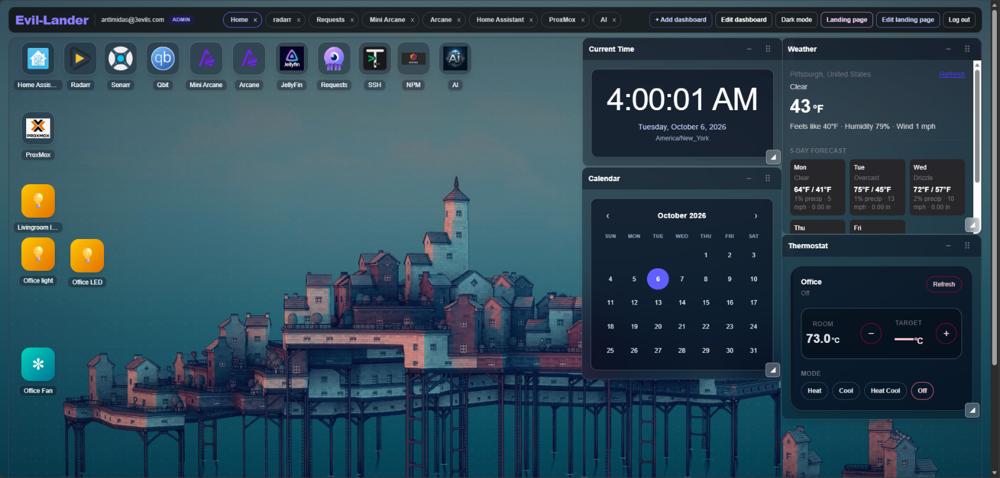
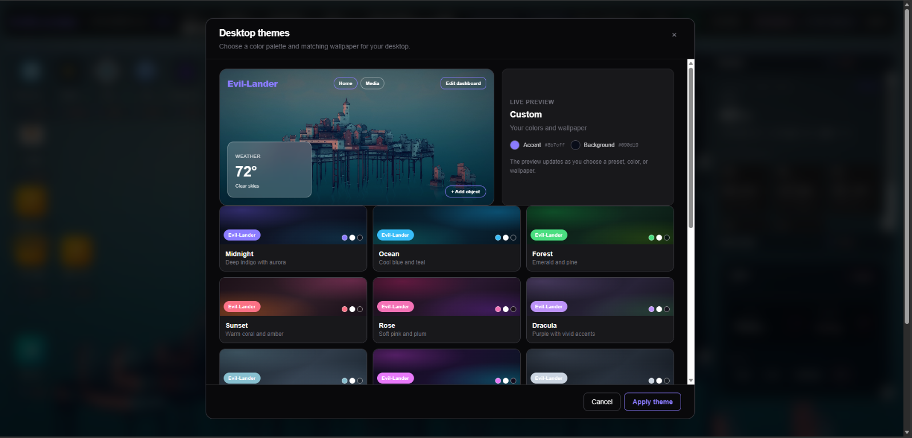

# Evil-Lander

Evil-Lander is a self-hosted homelab dashboard with a customizable public landing page, multiple personal dashboards, draggable and resizable widgets, website embeds, and Home Assistant controls.

## Features

- Public landing page with selectable original, solid-color, or uploaded-image backgrounds; an admin-managed logo; up to eight movable images; and a movable, font-customizable welcome text box.
- Account signup and login. The first account created is the admin; later accounts are regular users.
- Multiple dashboards with tabs and dedicated iframe dashboards.
- Desktop shortcuts and frosted-glass widgets that can be moved and resized. Widgets can collapse to desktop icons.
- Markdown, links, buttons, images, clock, calendar, weather, and website embeds.
- Home Assistant entity, light, fan, thermostat, and dashboard cards.
- Theme presets, a live theme preview, custom colors, and persistent wallpaper uploads.

## Screenshots

### Dashboard



### Landing page


### Theme picker



## Install on Windows, macOS, or Linux

### Windows

Requirements: Windows 10 or newer on x64 or ARM64, an internet connection, and a user account with write access to its local application-data directory. The installer does not require administrator privileges.

From PowerShell, clone the repository and run the per-user installer:

```powershell
git clone https://github.com/antimidas/evil-lander.git
cd evil-lander
powershell -ExecutionPolicy Bypass -File .\scripts\install.ps1
```

#### What the installer does

The installer:

- Downloads a checksum-verified Node.js release if Node.js 22.13 or newer with npm is not already available (installed to `%LOCALAPPDATA%\Evil-Lander\node-v*`)
- Installs the pinned pnpm release under `%LOCALAPPDATA%\Evil-Lander\pnpm`
- Installs project dependencies from `pnpm-lock.yaml`
- Generates a private encryption key in `.env.local` if one does not already exist
- Builds the production app
- Adds its local Node.js and pnpm directories to your user `PATH` (open a new PowerShell window after installation)

#### Interactive installer

When run in a PowerShell terminal, the installer prompts for:

- **Install location**: Where to install the web app. If you specify a different directory, application files are copied there (except `node_modules`, `.next`, `.git`, `.data`, and `.env.local`). The default is the current checkout.
- **Port**: The port the app listens on (1–65535, default 3000). This is saved as `PORT` in `.env.local` and used by `pnpm start -p` and the production build.
- **Admin account** (optional): Leave blank to skip admin creation (the first account to sign up becomes admin). Otherwise, enter an email-style username (the app signs in with email, e.g. `admin@lander.local`) and a password (1–128 characters). An existing user with that email is left unchanged.

#### Unattended installation

For scripted/unattended installs, set environment variables and pass command-line options:

```powershell
$env:INSTALL_ADMIN_PASSWORD = 'secure-password-here'
powershell -ExecutionPolicy Bypass -File .\scripts\install.ps1 `
  -Yes `
  -Dir 'C:\homelab' `
  -Port 8080 `
  -Admin 'admin@lander.local'
```

Installer options:

- `-Yes` or `-Y`: Skip prompts and use the options below (or defaults)
- `-Dir PATH`: Install location for the web app (default: current checkout)
- `-Port PORT`: Port to listen on (default: 3000)
- `-Admin EMAIL`: Admin username to create (email-style; empty or omit to skip)
- `-Help` or `-H`: Show help and exit

#### Starting the app after installation

After installation, close and reopen PowerShell, then:

**Production mode:**

```powershell
cd C:\path\to\evil-lander
pnpm start -p 8080
```

(Replace `8080` with your configured port if different from 3000.)

**Development mode:**

```powershell
pnpm dev -p 8080
```

Open [http://localhost:8080](http://localhost:8080) (or your configured port) in a browser. If you created an admin account during install, sign in with that email and password. Otherwise, sign up to create the first account, which receives the admin role.

**Runtime configuration:**

The `.env.local` file in the install directory contains:

- `AUTH_ENCRYPTION_KEY`: Private key for secure session storage (generated at install time)
- `PORT`: The port the app listens on (set by the installer)

Both stay local and are excluded from Git.

### macOS or Linux

Requirements: macOS or a glibc-based Linux distribution, an internet connection, and a user account with write access to its home directory. The installer downloads a checksum-verified Node.js release when Node.js 22.13 or newer with npm is not already available. It installs the pinned pnpm release, project dependencies, generates a private Home Assistant encryption key in `.env.local` if one is not already set, and builds the production app.

Clone the repository and run the installer:

```bash
git clone https://github.com/antimidas/evil-lander.git
cd evil-lander
./scripts/install.sh
```

If you fork the project, replace `antimidas` with your GitHub account or organization.

When run in a terminal, the installer shows a TUI (`whiptail` or `dialog` if installed, otherwise plain prompts) to choose:

- the install location of the web app (files are copied there if it is not the current checkout),
- the port it listens on (saved as `PORT` in `.env.local`; used by `pnpm start -p`, `dashboard start` and the systemd service),
- an optional admin account. Leave the username blank to skip; otherwise enter an email-style name (the app signs in with email) and a password. An existing user is left unchanged.

For unattended installs: `INSTALL_ADMIN_PASSWORD=... ./scripts/install.sh --yes --dir ~/lander --port 8080 --admin admin@lander.local`.

The installer supports:

- macOS on Apple Silicon and Intel.
- glibc-based Linux on x86-64 and ARM64, using `apt`, `dnf`, or `pacman` when system download/checksum tools are missing.

It installs Node.js under `~/.local/share/evil-lander` only when the current Node.js is older than 22.13 or npm is missing. pnpm is installed under `~/.local` only if the pinned project version is not already available. On Linux, missing system tools are installed through the detected package manager and may require `sudo`. If `~/.local/bin` is not already on your shell's `PATH`, add it before running `pnpm` or `dashboard` commands:

```bash
export PATH="$HOME/.local/bin:$PATH"
```

If the installer downloaded a private Node.js copy, it prints an additional `PATH` command for that Node.js installation. Run the printed commands in your shell before starting the app.

Run the app in development mode:

```bash
pnpm dev
```

Or run the production build created by the installer:

```bash
pnpm start
```

Open [http://localhost:3000](http://localhost:3000). Sign up to create the first account, which receives the admin role.

### Install from an existing project directory

If you already have this project directory, run the installer for your platform:

```bash
./scripts/install.sh
```

On Windows, run:

```powershell
powershell -ExecutionPolicy Bypass -File .\scripts\install.ps1
```

The script is safe to rerun. It uses the checked-in `pnpm-lock.yaml` to install the exact dependency versions.

## Configuration

The installer creates `.env.local` with a random 256-bit `AUTH_ENCRYPTION_KEY` if the file does not already contain one. The key is required to securely store the Home Assistant access token.

- Keep `.env.local` private and do not commit it.
- Back up the key somewhere secure. Saved Home Assistant credentials cannot be decrypted if the key is lost or changed.
- `AUTH_DB_PATH` optionally changes the SQLite database path. By default, account and dashboard data is stored in `.data/auth.sqlite`.
- Landing-page appearance, each user's desktop theme, and each user's selected private landing-page widgets are kept together in the editable `.data/user-settings.json` file. It is created automatically, kept out of Git, and read again on each settings request. Back up this file together with `.data/auth.sqlite`.
- Store `.data` on persistent storage. The SQLite setup is intended for a single app server, not multiple independently running instances.

The first account is the admin. The admin can configure the Home Assistant URL and long-lived access token from **Home Assistant settings** in dashboard edit mode. The token is encrypted at rest and is not returned to the browser.

### Linux systemd service

On Linux with a user systemd manager, install and start the production service after running the installer:

```bash
./dashboard install
dashboard start
```

Manage it with:

```bash
dashboard status
dashboard logs
dashboard restart
dashboard stop
```

The user service starts with the user's systemd session. To enable it at boot before login, enable lingering for your user:

```bash
sudo loginctl enable-linger "$USER"
```

### macOS production mode

Run the production server in the foreground:

```bash
pnpm start
```

Stop it with `Ctrl+C`. For development, use `pnpm dev`.

## Usage

The public home page does not open the login dialog automatically. Use **Log in** to sign in or create an account. Only signed-in admins can see **Landing page settings** and customize the public landing page. After signing in, admins can choose the original artwork, a solid color, or a custom background; upload a logo and up to eight additional images; and customize the welcome text font, size, and color. Arrange the logo, images, and text by dragging them on the page. Landing images support PNG, JPEG, WebP, and GIF, with a 12 MB per-image and 24 MB total upload limit.

Signed-in users can choose **Landing widgets** on the home page to display their own dashboard objects there; private widgets are fetched and rendered only while signed in. Use **Arrange widgets** and drag a widget directly to move it; **Save widget layout** persists its position in `.data/user-settings.json`. Landing widgets display without an added title card or panel. On the dashboard, **Landing page** returns home without signing out, and an admin can use **Edit landing page** to open its settings directly. The dashboard returns to the landing page after one minute without pointer, keyboard, touch, or scroll activity; this does not sign the user out. Desktop themes and uploaded wallpapers are saved server-side in `.data/user-settings.json` and follow the account across browsers.

Use **Edit dashboard** and **Add object** to create content. For supported content cards, select either an expanded desktop widget or a desktop icon that opens a modal. Drag widget title bars to move widgets, use the lower-right grip to resize them, and use the title-bar collapse control to reduce a widget to an icon. Changes to dashboard object positions and sizes are saved to the server.

Themes are selected in dashboard edit mode. Presets include Midnight, Ocean, Forest, Sunset, Rose, Dracula, Nord, Cyberpunk, Slate, AMOLED, and Cloud. Custom colors can be selected visually; wallpaper images can be selected from a URL or uploaded from the device. Theme settings, light/dark mode, and uploaded wallpapers are saved to `.data/user-settings.json` for the signed-in account, and are available across browsers. Uploaded theme wallpapers may be up to 64 MiB.

## Home Assistant and embeds

Use a public HTTPS URL for Home Assistant when it is behind a reverse proxy, and enable WebSocket support on the proxy. If embedding Home Assistant, configure its trusted reverse proxies and framing settings carefully. Disabling `X-Frame-Options` allows other sites to frame Home Assistant; only do so if that is an acceptable security tradeoff. Prefer HTTPS for both Evil-Lander and embedded services.

Some websites intentionally block iframe embedding. Those sites cannot be made embeddable by the dashboard; use their desktop shortcut to open them directly instead.

## Development

```bash
pnpm install --frozen-lockfile
pnpm dev
```

Quality checks:

```bash
pnpm lint
pnpm exec tsc --noEmit
pnpm build
```

## Project stack

- Next.js 16 App Router
- React 19
- TypeScript
- Tailwind CSS 4
- SQLite via Node.js built-in `node:sqlite`
- pnpm 12
